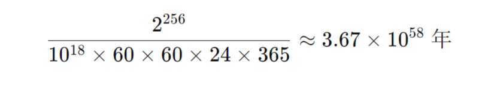
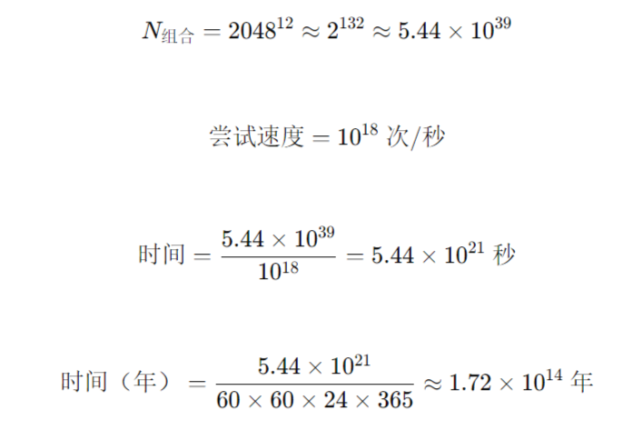
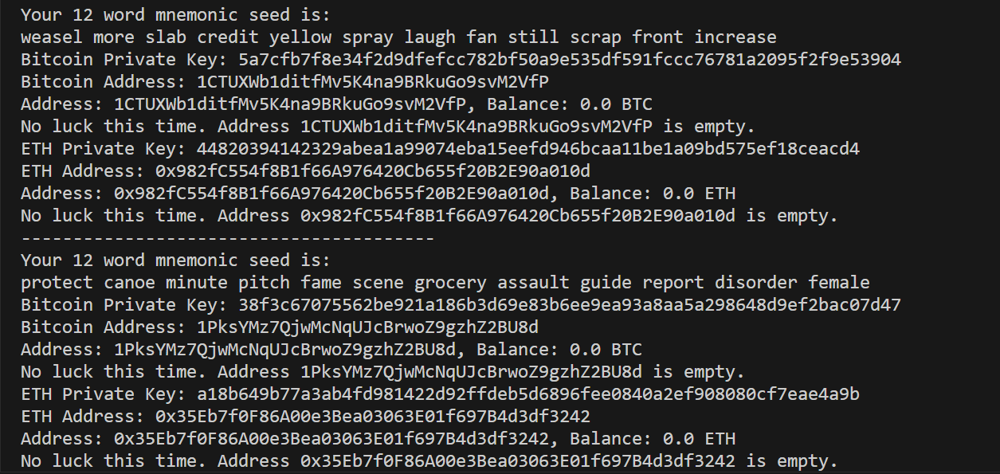

# CryptoLottery 

[English](./README_EN.md)

这是一个愚蠢的项目，不过你仍然可以尝试。

你肯定想过通过爆破的方式得到某个加密货币地址的私钥，或者随机创建很多私钥来计算出地址，恰好某个地址中有不少加密资产。


已知比特币的私钥是256位的随机数，BIP-39的助记词有2048个，所以有:

私钥的排列组合总数：2^256 种<br>
12位助记词排列组合：2048^12 ≈ 2^132 种


如果在2025年的今天，你恰好拥有这个星球上最强的超级计算机，每秒钟可以尝试10^18个组合，那么

遍历完所有的比特币私钥需要这些时间：



助记词会好一点：



而宇宙诞生至今约为 1.38×10^10年(138亿)........


好消息是，截止到这个readme编辑时，非0资产的比特币地址数量约为5500万个，这意味着你不必全部遍历完，就能遇到有效地址。坏消息是，它们是稀疏分布在空间中的。

但是 1/2^256 和 55000000/2^256 大小也没差多少就是了.........


另外比特币的私钥和地址之间不是一一对等的，2^256个私钥只对应2^160个地址，有可能会两个私钥会解开同一个地址，这无疑给游戏增加了一丝丝的趣味性。


## 使用

本项目选择用随机的方式生成 BTC、ETH、SOL 的私钥，然后计算出公钥和地址，通过节点提供的 API 验证地址中是否有资产，如果地址中有资产便会发出提醒。

赌的就是 1/2^256(BTC) 和 1/2^132(ETH、SOL) 的概率................(命硬)


1. 克隆项目到本地：
    ```bash
    git clone https://github.com/mmmlllnnn/CryptoLottery.git
    cd CryptoLottery
    ```

2. 安装依赖：(需要 C++ 构建环境)
    ```bash
    pip install -r requirements.txt
    ```

3. 配置 config.ini:
    ```bash
    [API]      #用于验证的API
    [CoinType] #尝试的币种
    [Lottery]  #运行次数
    ```

4. 运行:
    ```bash
    python lottery.py
    ```




(BTC地址生成选择 Base58，而不是 Bech32，因为被验证的沉没资产大多形式为 Base58)

just for fun !!!
