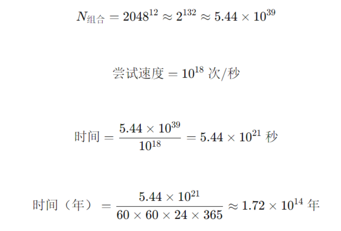
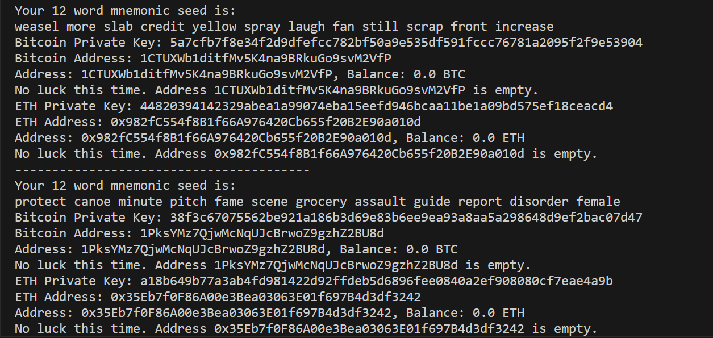

# CryptoLottery

[中文](./README.md)

This is a stupid project, but you can still try it.

You must have thought about getting the private key of a certain cryptocurrency address by blasting, or randomly creating many private keys to calculate the address, and there happens to be a lot of crypto assets in a certain address.

It is known that the private key of Bitcoin is a 256-bit random number, and there are 2048 mnemonics in BIP-39, so there are:

Total number of permutations and combinations of private keys: 2^256<br>
Permutations and combinations of 12-bit mnemonics: 2048^12 ≈ 2^132

If in 2025, you happen to have the most powerful supercomputer on the planet, and can try 10^18 combinations per second, then

It will take this time to traverse all Bitcoin private keys:


Mnemonics will be a little better:



And the universe has been around for about 1.38×10^10 years (13.8 billion) since its birth........

The good news is that as of the time of editing this readme, the number of Bitcoin addresses with non-zero assets is about 55 million, which means you don't have to traverse all of them to encounter valid addresses. The bad news is that they are sparsely distributed in space.

But there is not much difference between 1/2^256 and 55000000/2^256.........

In addition, the private key and address of Bitcoin are not one-to-one. 2^256 private keys only correspond to 2^160 addresses. It is possible that two private keys will unlock the same address, which undoubtedly adds a little fun to the game.


## Use

This project chooses to generate the private keys of BTC, ETH, and SOL in a random way, and then calculates the public key and address. It verifies whether there are assets in the address through the API provided by the node. If there are assets in the address, a reminder will be issued.

The bet is the probability of 1/2^256 (BTC) and 1/2^132 (ETH, SOL)................

1. Clone the project to local:
```bash
git clone https://github.com/mmmlllnnn/CryptoLottery.git
cd CryptoLottery
```

2. Install dependencies: (requires C++ build environment)
```bash
pip install -r requirements.txt
```

3. Configure config.ini:
```bash
[API] #API for verification
[CoinType] #Currency to try
[Lottery] #Number of runs
```

4. Run:
```bash
python lottery.py
```



(Base58 is selected for BTC address generation instead of Bech32, because most of the verified sunken assets are in Base58)

just for fun!!!